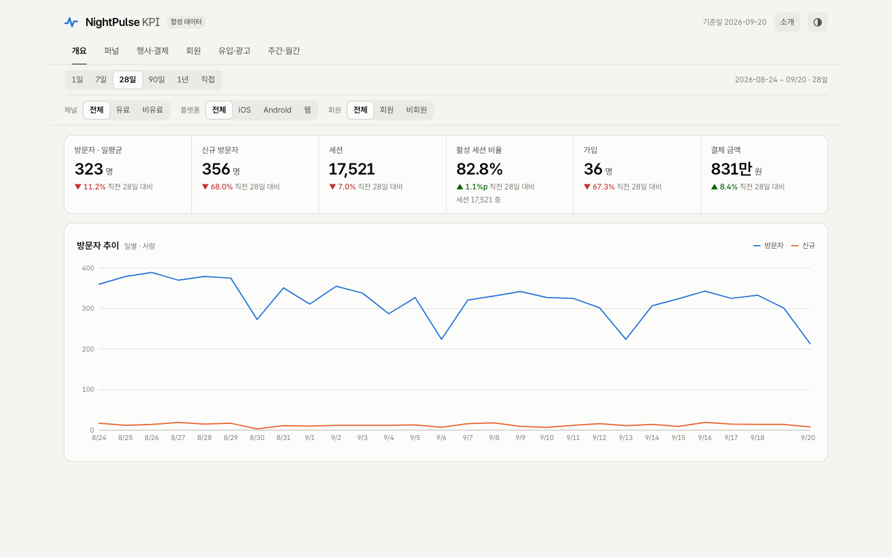
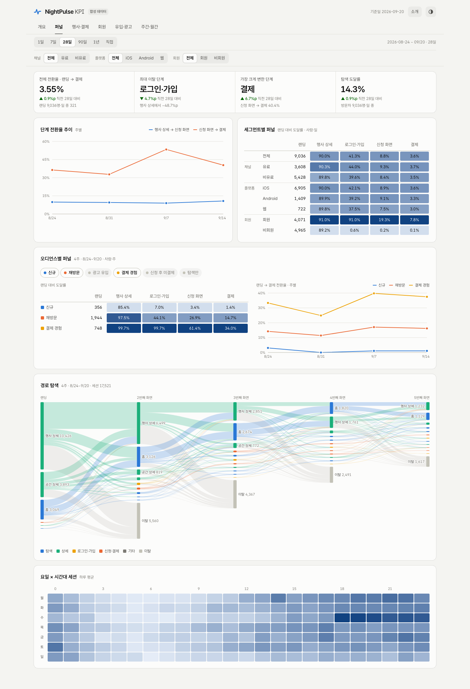
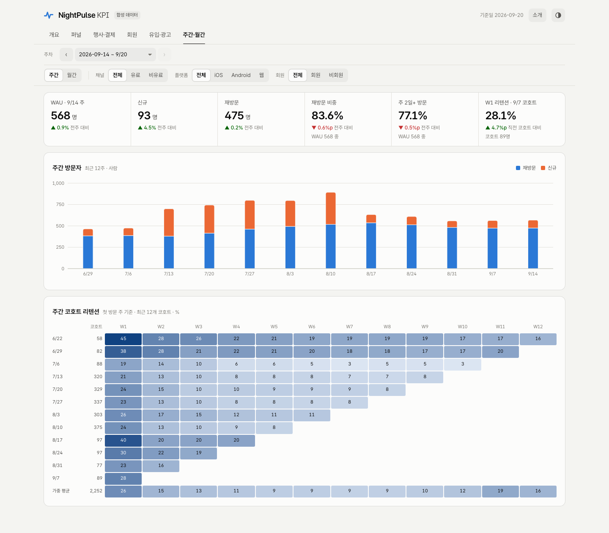
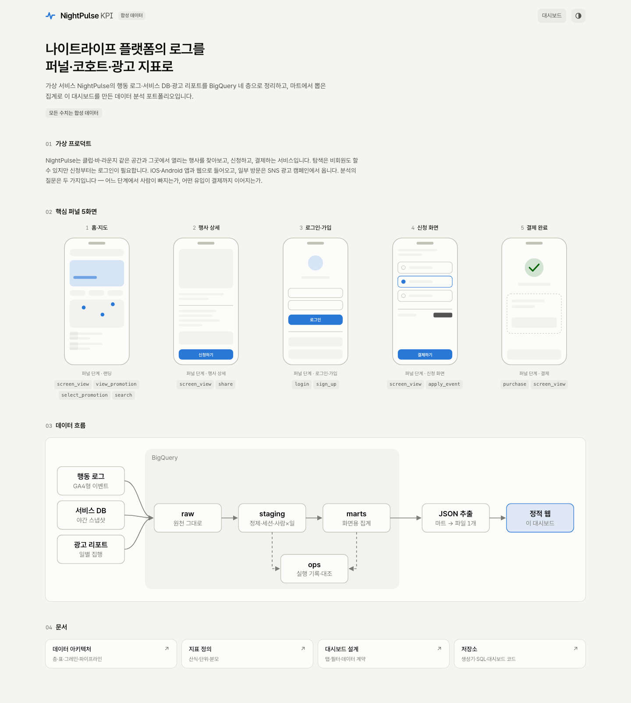

# nightpulse-analytics

가상 나이트라이프 플랫폼 NightPulse의 GA4형 행동 로그·서비스 DB 스냅샷·광고 리포트를 BigQuery 네 층(raw → staging → marts → ops)으로 정리하고, 마트에서 뽑은 집계로 퍼널·코호트·광고 KPI 대시보드(정적 웹)를 만든 데이터 분석 포트폴리오.

**이 저장소의 데이터는 전부 생성기가 만든 합성 데이터다.** 실제 서비스·회사의 데이터, 코드, 식별자는 들어 있지 않다. 설계는 업무 경험에서 온 일반적인 패턴을 새로 작성한 것이다.

- 대시보드: `<Vercel URL>`
- 소개 페이지: `<Vercel URL>/?page=about`

## 화면

| 개요 | 퍼널 |
|---|---|
|  |  |
| **주간 코호트** | **소개** |
|  |  |

탭 6개(개요 / 퍼널 / 행사·결제 / 회원 / 유입·광고 / 주간·월간)와 소개 페이지. 필터(기간·채널·플랫폼·회원)는 마트에 그 축이 있는 카드에만 붙이고, 상태는 전부 URL에 남는다. 탭별 구성과 산식은 [docs/dashboard.md](docs/dashboard.md).

## 무엇을 보여주는가

- **층 설계와 그레인.** 원천을 `raw`에 그대로 두고, 정제·세션 판정·신원 해소는 `staging`에서 한 번만, 화면이 읽는 집계는 `marts`, 실행 기록과 대조는 `ops`. 모든 표에 "1행 = 무엇"과 키를 적었다.
- **단위를 섞지 않는 지표.** 사람(`person_id`)·세션·건을 구분하고, 여러 날의 사람 수를 더하면 `사람·일`로 표기한다. 기간 고유 사람 수는 주간·월간 마트에서만 읽는다.
- **로그와 원장의 대조.** 결제·신청 건수·금액은 서비스 DB 원장이 기준이고, 로그 집계와의 차이를 검사로 남긴다. 검사가 하나라도 실패하면 파이프라인이 멈춘다.
- **질문에서 출발한 탭.** 퍼널 탭은 "어느 단계가, 언제부터, 어느 집단에서 나빠졌나"를 스코어보드 → 추이 → 세그먼트 비교 → 오디언스·경로 드릴다운 순서로 답한다.
- **문서가 코드에서 나온다.** SQL 머리 주석에서 표 카탈로그·계보 도식을 생성하고, 주석과 실물 표가 어긋나면 생성기가 실패한다.

## 구조

```
generator/   시드 분포(generator/seed/*.csv) → 이벤트 로그 · 서비스 DB 원장 · 광고 리포트 생성, 검증
bigquery/    자체 SQL: raw 적재 → staging → marts → ops, 검사, 1회 실행 스크립트, 표 카탈로그 생성기
dashboard/   마트 → data.json 추출 → Vite + React 정적 웹, 헤드리스 캡처
docs/        아키텍처 · 지표 정의 · 파이프라인 · 대시보드 설계 · 백로그
data/        생성물 (gitignore, MANIFEST.txt 만 커밋)
scripts/     bq.sh — 개인 GCP 전용 래퍼 (설정 폴더·프로젝트·리전 고정)
```

`generator/seed/` 의 CSV는 이벤트 비중·전이 확률·요일×시간 패턴·채널 구성·리텐션 곡선 같은 **비율·분위수**뿐이다. 절대값·식별자·실명은 없다.

## 실행 순서

생성 → 적재 → 추출 → 빌드. 모두 저장소 루트에서 실행한다(대시보드 빌드만 `dashboard/`).

```bash
# 1. 생성 — 합성 로그·원장·광고 리포트를 data/ 에 쓴다 (같은 시드면 같은 결과)
uv run generator/generate.py --seed 20260923 --weeks 52 --persons 8000 --end-date 2026-09-20 --out data/
uv run generator/validate.py --data data/ --weeks 52 --end-date 2026-09-20

# 2. 적재 — raw 적재 → staging → marts → ops 검사·기록 (개인 GCP 프로젝트)
scripts/bq.sh login            # 최초 1회
bigquery/load_all.sh

# 3. 추출 — marts 13개를 dashboard/public/data.json 한 파일로
uv run dashboard/scripts/extract.py

# 4. 빌드 — 정적 웹 (dist/ 를 어느 정적 호스트에든 올린다)
cd dashboard && npm ci && npm run build
npm run capture -- --all       # 선택: 탭별·다크·폰 폭 캡처
```

BigQuery 없이 화면만 보려면 1~3 대신 `uv run dashboard/scripts/make_sample_data.py --out dashboard/public/data.json` 으로 같은 계약의 샘플을 만든다. 저장소에 커밋된 `data.json` 은 BigQuery 추출본이며 이 명령은 그 파일을 덮어쓴다.

## 설계 문서

| 문서 | 내용 |
|---|---|
| [docs/architecture.md](docs/architecture.md) | 원천·층·표·그레인·신원 규칙 |
| [docs/metrics.md](docs/metrics.md) | 지표 정의 — 단위·분자·분모·제외 규칙, 마트 열 기준 |
| [docs/dashboard.md](docs/dashboard.md) | 탭·필터 원칙, 화면 산식, `data.json` 데이터 계약, 소개 페이지 |
| [docs/pipeline.md](docs/pipeline.md) | 실행·재실행·실패 조치 |
| [docs/backlog.md](docs/backlog.md) | 결정된 작업 순서와 이후 후보 |
| [bigquery/README.md](bigquery/README.md) | 표 카탈로그·계보 도식·검사 목록 (SQL 머리 주석에서 생성) |

## 이 저장소에 없는 것

- 실제 서비스의 로그·DB·광고 데이터, 그리고 그 수치
- 인증 키·서비스 계정·접속 정보 (BigQuery 접근은 로컬 개인 인증으로 `scripts/bq.sh` 안에서만)
- 특정 회사의 코드·SQL·문서·식별자

## 라이선스

MIT
