<!-- 생성물: python3 bigquery/build_catalog.py 가 SQL 머리 주석에서 만든다. 직접 고치지 않는다. -->
# bigquery — 표 카탈로그

합성 이벤트 로그와 서비스 원장을 raw → staging → marts → ops 네 층으로 쌓는 SQL 모음. 표 48개, 층마다 BigQuery 데이터셋 하나. 이 문서의 모든 표 정보는 각 SQL 파일 머리 주석에서 온다.

```bash
bigquery/load_all.sh                     # 적재 → 정제 → 마트 → 검사 → 신선도 (0~9단계)
bigquery/load_all.sh --only 8            # 검사만
python3 bigquery/build_catalog.py        # 이 문서 재생성 (주석·본문·실물 대조, 어긋나면 exit 1)
```

운영 절차·재실행·실패 조치는 [docs/pipeline.md](../docs/pipeline.md).

머리 주석 틀 (모든 SQL 파일 첫 줄부터, 검사는 있을 때만):

```sql
-- 표: <층.표> — <한 줄 설명>
-- 1행: <그레인>
-- 키: <고유 키>
-- 파티션·클러스터: <파티션 식 또는 없음> / <클러스터 열 또는 없음>
-- 원천: <읽는 표와 용도>
-- 소비: <이 표를 읽는 표·화면>
-- 검사: <checks/reconciliation.sql 의 검사 ID>
--
-- <규칙·메모 자유 서술>
```

## 표 카탈로그

### raw — 원천 적재

| 표 | 1행 | 키 | 파티션 / 클러스터 | 원천 | 소비 | 검사 | 파일 |
|---|---|---|---|---|---|---|---|
| **ga4_events**<br>행동 로그 원천 (GA4 export 단순화, 합성) | 이벤트 1건 | (user_pseudo_id, ga_session_id, event_timestamp, event_name) | event_date / event_name | data/raw/ga4_events.ndjson.gz (생성기 출력). event_date 는 KST, 파티션 필터 필수 | staging.map_channel·events_clean |  | [raw_tables.sql](schema/raw_tables.sql) |
| **db_members**<br>서비스 RDB 회원 스냅샷 (합성) | 회원 1명 | member_id | 없음 / 없음 | data/raw/db_members.csv (생성기 출력) | staging.int_person_day·dim_member |  | [raw_tables.sql](schema/raw_tables.sql) |
| **db_venues**<br>서비스 RDB 공간 스냅샷 (합성) | 공간 1곳 | venue_id | 없음 / 없음 | data/raw/db_venues.csv (생성기 출력). 상권·구·좌표·등록일·상태 포함 | staging.dim_event·dim_venue, ops.reconciliation |  | [raw_tables.sql](schema/raw_tables.sql) |
| **db_events**<br>서비스 RDB 행사 스냅샷 (합성) | 행사 1건 | event_id | 없음 / 없음 | data/raw/db_events.csv (생성기 출력). 정원·가격대·가격·개최 시점 파트너 여부 포함 | staging.dim_event·dim_venue·fct_order |  | [raw_tables.sql](schema/raw_tables.sql) |
| **db_applications**<br>서비스 RDB 신청 원장 스냅샷 (합성) | 신청 1건 | order_id | 없음 / 없음 | data/raw/db_applications.csv (생성기 출력) | staging.fct_order, ops.reconciliation |  | [raw_tables.sql](schema/raw_tables.sql) |
| **db_payments**<br>서비스 RDB 결제 원장 스냅샷 (합성) | 결제 1건 | order_id | 없음 / 없음 | data/raw/db_payments.csv (생성기 출력). kind = ticket / subscription, 할인액·구독 ID 포함 | staging.fct_order·dim_subscription, ops.reconciliation |  | [raw_tables.sql](schema/raw_tables.sql) |
| **db_venue_contracts**<br>서비스 RDB 파트너 계약 스냅샷 (합성) | 계약 1건 | contract_id | 없음 / 없음 | data/raw/db_venue_contracts.csv (생성기 출력). ended_at NULL = 진행 중 | staging.dim_contract |  | [raw_tables.sql](schema/raw_tables.sql) |
| **db_venue_contract_changes**<br>서비스 RDB 파트너 계약 요금제 변경 스냅샷 (합성) | 요금제 변경 1건 | change_id | 없음 / 없음 | data/raw/db_venue_contract_changes.csv (생성기 출력). changed_at(UTC, KST 자정)부터 to_plan·to_fee 적용 | staging.dim_contract_change |  | [raw_tables.sql](schema/raw_tables.sql) |
| **db_subscriptions**<br>서비스 RDB 소비자 구독 스냅샷 (합성) | 구독 1건 | subscription_id | 없음 / 없음 | data/raw/db_subscriptions.csv (생성기 출력). ended_at NULL = 진행 중 | staging.dim_subscription, ops.reconciliation |  | [raw_tables.sql](schema/raw_tables.sql) |
| **ads_spend**<br>광고 플랫폼 일별 집행 리포트 (합성) | 캠페인 × 일 | (campaign_id, date) | date / 없음 | data/raw/ads_spend.csv (생성기 출력). date 는 KST | staging.ad_spend |  | [raw_tables.sql](schema/raw_tables.sql) |

### staging — 정제·중간·차원

| 표 | 1행 | 키 | 파티션 / 클러스터 | 원천 | 소비 | 검사 | 파일 |
|---|---|---|---|---|---|---|---|
| **map_channel**<br>채널 3단계 매핑 | (source, medium) 1쌍 | (source, medium) | 없음 / 없음 | raw.ga4_events.traffic_source (관측된 쌍 전부) | staging.int_session (세션 라스트클릭 채널 — 채널·광고 마트는 이 열을 쓴다) |  | [01_map_channel.sql](sql/01_map_channel.sql) |
| **map_fee_rate**<br>공간 등급별 거래 수수료율 | 수수료 등급 1개 | fee_tier | 없음 / 없음 | 없음 (이 파일의 상수) | staging.fct_order (티켓 수수료) |  | [01_map_fee_rate.sql](sql/01_map_fee_rate.sql) |
| **events_clean**<br>정제 이벤트 | 이벤트 1건 | (client_id, session_id, event_at, event_name) | kst_date / event_name, client_id | raw.ga4_events | staging.int_session, marts.daily_event·daily_venue·weekly_path·venue_registry, ops.reconciliation | C1a·C1b·C2·I3 | [02_events_clean.sql](sql/02_events_clean.sql) |
| **int_session**<br>세션 판정 단일 원본 | 세션 1건 | (client_id, session_id) | session_date / person_id | staging.events_clean, staging.map_channel | staging.int_person_day·dim_member, marts.hourly_metrics·daily_channel·daily_ad·daily_event·daily_venue·monthly_summary·weekly_audience_funnel·weekly_path·venue_registry, ops.reconciliation | I1·I2·R7·R8 | [03_int_session.sql](sql/03_int_session.sql) |
| **dim_subscription**<br>소비자 구독 차원 | 구독 1건 | subscription_id | 없음 / member_id | raw.db_subscriptions, raw.db_payments (구독 결제 집계) | staging.int_person_day, marts.daily_subscription·subscription_cohort |  | [04_dim_subscription.sql](sql/04_dim_subscription.sql) |
| **int_person_day**<br>사람 × 일 중간 표 | 사람 × 일(KST, 세션 시작일) | (person_id, kst_date) | kst_date / channel1, device_platform, member_seg | staging.int_session·dim_subscription (그날 활성 구독), raw.db_members (가입일) | marts.daily_metrics·funnel_daily·weekly_cohort·monthly_cohort·weekly_activity·monthly_summary, marts.daily_channel·hourly_metrics·weekly_audience_funnel·weekly_path·person_day, ops.reconciliation | R3 | [04_int_person_day.sql](sql/04_int_person_day.sql) |
| **dim_member**<br>회원 차원 | 회원 1명 | member_id | 없음 / member_id | raw.db_members (속성의 진실), staging.int_session (첫 유입·첫 방문을 로그에서 역산) | marts.weekly_cohort·monthly_cohort·weekly_activity·monthly_summary·weekly_audience_funnel·weekly_path (가입일), 회원 탭 분포, 애드혹 분석 |  | [05_dim_member.sql](sql/05_dim_member.sql) |
| **ad_spend**<br>광고 집행 정리 | 캠페인 × 일(KST) | (campaign_id, kst_date) | kst_date / campaign_id | raw.ads_spend | marts.daily_ad·monthly_summary (월 광고비), ops.reconciliation (집행일) |  | [06_ad_spend.sql](sql/06_ad_spend.sql) |
| **dim_contract**<br>공간 파트너 계약 차원 | 계약 1건 | contract_id | 없음 / venue_id | raw.db_venue_contracts | staging.dim_contract_change·int_contract_day·dim_venue, marts.daily_venue_registry·monthly_contract·contract_cohort, ops.reconciliation |  | [06_dim_contract.sql](sql/06_dim_contract.sql) |
| **dim_contract_change**<br>파트너 계약 요금제 변경 이력 | 요금제 변경 1건 | change_id | 없음 / contract_id | raw.db_venue_contract_changes, staging.dim_contract (계약 기간) | staging.int_contract_day, marts.monthly_contract |  | [06_dim_contract_change.sql](sql/06_dim_contract_change.sql) |
| **dim_event**<br>행사 차원 | 행사 1건 | event_id | 없음 / event_id | raw.db_events, raw.db_venues, staging.fct_order | marts.daily_event·venue_registry (행사 속성·365일 개최 행사), 행사 리스트 |  | [06_dim_event.sql](sql/06_dim_event.sql) |
| **dim_venue**<br>공간 차원 | 공간 1곳 | venue_id | 없음 / 없음 | raw.db_venues, raw.db_events, staging.dim_contract, staging.int_contract_day (그 계약의 마지막 활성일 요금제) | marts.daily_venue·daily_venue_registry·venue_registry (공간 속성) |  | [06_dim_venue.sql](sql/06_dim_venue.sql) |
| **fct_order**<br>주문 원장 정리 (티켓 신청 + 구독 결제) | 주문 1건 = 티켓 신청 1건(kind ticket) 또는 구독 결제 1건(kind subscription) | order_id | applied_date / kind, event_id | raw.db_applications, raw.db_payments, raw.db_events, staging.int_contract_day (개최일 공간 요금제 → 수수료 등급), staging.map_fee_rate (등급별 수수료율) | staging.dim_event, marts.daily_event·daily_venue·monthly_summary·daily_revenue·daily_subscription·venue_registry, ops.reconciliation | R5·R6·I4·C9·C14·R10·R11 | [06_fct_order.sql](sql/06_fct_order.sql) |
| **int_contract_day**<br>파트너 계약 활성일 (요금제 변경 반영) | 계약 × 활성일(KST) | (contract_id, kst_date) | kst_date / venue_id | staging.dim_contract (계약 기간), staging.dim_contract_change (요금제 변경) | staging.fct_order·dim_venue, marts.daily_revenue·daily_venue_registry·monthly_contract·contract_cohort |  | [06_int_contract_day.sql](sql/06_int_contract_day.sql) |

### marts — 화면용 지표·리스트

| 표 | 1행 | 키 | 파티션 / 클러스터 | 원천 | 소비 | 검사 | 파일 |
|---|---|---|---|---|---|---|---|
| **contract_cohort**<br>파트너 계약 시작 월 코호트 유지 | 코호트 월(계약 시작 월) × 경과 월(0~12) | (cohort_month, month_offset) | DATE_TRUNC(cohort_month, MONTH) / 없음 | staging.dim_contract (시작일·스냅샷 기준일), staging.int_contract_day (확인일 활성·요금) | 공간 탭 계약 코호트 히트맵 |  | [contract_cohort.sql](sql/marts/contract_cohort.sql) |
| **daily_ad**<br>광고 성과 마트 | 일(KST) × 캠페인 | (kst_date, campaign_id) | kst_date / campaign_id | staging.ad_spend (집행), staging.int_session (광고 세션 = 세션 라스트클릭 channel1 paid, campaign 일치) | 유입·광고 탭 캠페인 보기 — 집행(지출·노출·클릭) → 유입(세션·방문자·활성 방문자) → 행동(가입·신청·결제). CTR·CAC·ROAS 는 화면에서 나눈다 |  | [daily_ad.sql](sql/marts/daily_ad.sql) |
| **daily_channel**<br>세션 채널 마트 | 일(KST) × 세션 채널 3단계 × device_platform × member_seg | 이 여섯 열 | kst_date / channel2, device_platform, member_seg | staging.int_session (세션 라스트클릭 채널), staging.int_person_day (기기·회원 세그먼트) | 유입·광고 탭 채널 보기. 광고 세션 비중 = channel1 = 'paid' 의 sessions / 전체 sessions. ops.reconciliation | C5 | [daily_channel.sql](sql/marts/daily_channel.sql) |
| **daily_event**<br>행사별 일 마트 (리스트 집계) | 일(KST) × 행사 | (kst_date, event_id) | kst_date / event_id | staging.events_clean·int_session (조회 흐름, 세션 시작일·사람 단위), staging.fct_order (원장, 신청일 기준), staging.dim_event (속성) | 행사 리스트, 행사 결제 퍼널 (상세 조회 → 신청 화면 → 신청 → 결제), ops.reconciliation. 세그먼트 축 없음 |  | [daily_event.sql](sql/marts/daily_event.sql) |
| **daily_metrics**<br>일 지표 마트 | 일(KST) × channel1 × device_platform × member_seg | 이 네 열 | kst_date / channel1, device_platform, member_seg | staging.int_person_day | 개요·탐색·행사·결제 흐름·회원 탭 스코어보드와 추이. 세그먼트 조합의 합 = 전체. ops.reconciliation | C3·R4 | [daily_metrics.sql](sql/marts/daily_metrics.sql) |
| **daily_revenue**<br>플랫폼 매출 종류별 일 마트 | 일(KST) × 매출 종류 × 수수료 등급(티켓만) | (kst_date, kind, fee_tier) | kst_date / kind | staging.fct_order (티켓·구독 결제, 결제일 기준), staging.int_contract_day (파트너 플랜 활성일·요금) | 개요 플랫폼 매출 타일·매출 구성 추이, 행사·결제 탭 매출 구성, 공간 탭 파트너 부담률. marts.monthly_summary, ops.reconciliation | C9·C14·R10·R11 | [daily_revenue.sql](sql/marts/daily_revenue.sql) |
| **daily_subscription**<br>구독 일 마트 | 일(KST) | kst_date | kst_date / 없음 | staging.dim_subscription (구독 원장), staging.fct_order (구독자의 티켓 결제, 결제일 기준) | 회원 탭 구독 보기 스코어보드·추이·구독자 결제 비교, 개요 기준일 구독자. marts.monthly_summary, ops.reconciliation | C10 | [daily_subscription.sql](sql/marts/daily_subscription.sql) |
| **daily_venue**<br>공간별 일 마트 (리스트 집계) | 일(KST) × 공간 | (kst_date, venue_id) | kst_date / venue_id | staging.events_clean·int_session (공간 상세·리뷰 조회, 세션 시작일·사람 단위), staging.fct_order (그 공간 행사의 신청, 신청일 기준), staging.dim_venue | 공간 상위 N 표. 단위가 공간이므로 사람 세그먼트 축이 없다 |  | [daily_venue.sql](sql/marts/daily_venue.sql) |
| **daily_venue_registry**<br>상권별 공간 등록·파트너 계약 일 마트 | 일(KST) × 상권 | (kst_date, region) | kst_date / region | staging.dim_venue (등록일·상권), staging.dim_contract (계약 시작·종료), staging.int_contract_day (활성일 요금제·요금) | 공간 탭 스코어보드·등록/파트너 누적 추이·상권별 표. marts.monthly_summary, ops.reconciliation | C11·C15 | [daily_venue_registry.sql](sql/marts/daily_venue_registry.sql) |
| **funnel_daily**<br>일 방문 퍼널 마트 | 일(KST) × 단계 × channel1 × device_platform × member_seg | 이 다섯 열 | kst_date / step_order, channel1, device_platform, member_seg | staging.int_person_day | 탐색 탭 방문 퍼널 5단계. 막대 = 이전 단계 대비 |  | [funnel_daily.sql](sql/marts/funnel_daily.sql) |
| **hourly_metrics**<br>시간대 마트 | 일(KST) × 시(KST, 세션 시작 시) × channel1 × device_platform × member_seg | 이 다섯 열 | kst_date / channel1, device_platform, member_seg | staging.int_session (세션), staging.int_person_day (세그먼트: 사람 × 일) | 요일 × 시간대 세션 히트맵, 1일 선택 시 시간별 차트. 세그먼트 필터를 받아야 해서 축을 둔다 |  | [hourly_metrics.sql](sql/marts/hourly_metrics.sql) |
| **monthly_cohort**<br>월간 리텐션 코호트 | 코호트 월 × 경과 월 × member_seg | 이 세 열 | DATE_TRUNC(cohort_month, MONTH) / month_offset, member_seg | staging.int_person_day, staging.dim_member | 월 리텐션 표. 리텐션 = retained / cohort_size (화면에서 나눈다) |  | [monthly_cohort.sql](sql/marts/monthly_cohort.sql) |
| **monthly_contract**<br>파트너 계약 월 흐름 (계약 수·플랜 MRR 다리) | 월(KST) × 요금제(basic / pro / all) | (month, plan) | DATE_TRUNC(month, MONTH) / plan | staging.dim_contract (계약 시작·종료), staging.int_contract_day (날짜별 요금제·요금), staging.dim_contract_change (요금제 변경) | 공간 탭 ARPA·계약 월 해지율·매출 해지율·GRR·NRR, ops.reconciliation | C15 | [monthly_contract.sql](sql/marts/monthly_contract.sql) |
| **monthly_summary**<br>월간 브리핑 표 | 월(KST) | month | DATE_TRUNC(month, MONTH) / 없음 | staging.int_person_day (방문), staging.int_session (세션·채널), staging.dim_member (가입), staging.fct_order (원장), staging.ad_spend (월 광고비), marts.weekly_cohort·daily_revenue·daily_subscription·daily_venue_registry (W1 리텐션·매출 구성·월말 구독자·월말 공간 — 같은 층 마트를 재사용해 정의를 한 곳에 둔다. 먼저 생성돼야 한다) | 주간·월간 탭 월간 보기의 브리핑 표. 비율은 분자·분모 열로 둔다. 예외: w1_retention 은 화면 계약상 비율(0~1)로도 둔다. 분자·분모는 w1_retained·w1_cohort_size |  | [monthly_summary.sql](sql/marts/monthly_summary.sql) |
| **person_day**<br>사람 × 일 행동 플래그 마트 (기간 고유 사람 수 계산용) | 사람 × 일(KST). 행동 플래그(비트 1~16384)가 하나도 없는 날(자동 로드만 있는 날)은 뺀다. 상태 비트 32768 만 있는 날도 뺀다 | (person_key, kst_date) | kst_date / person_key | staging.int_person_day | 대시보드 사람 지표 타일·분해·전기 대비(기간 고유 사람 수). ops.reconciliation | C8 | [person_day.sql](sql/marts/person_day.sql) |
| **subscription_cohort**<br>멤버십 구독 시작 월 코호트 유지 | 코호트 월(구독 시작 월) × 경과 월(0~9) | (cohort_month, month_offset) | DATE_TRUNC(cohort_month, MONTH) / 없음 | staging.dim_subscription (시작·종료일·스냅샷 기준일) | 회원 탭 구독 보기 코호트 히트맵 |  | [subscription_cohort.sql](sql/marts/subscription_cohort.sql) |
| **venue_registry**<br>공간 목록 (기준일 스냅샷, 리스트 집계) | 공간 1곳 | venue_id | 없음 / region | staging.dim_venue (속성·파트너 여부·요금제·계약일), staging.dim_event (개최 행사), staging.fct_order (티켓 매출), staging.events_clean·int_session (공간 상세 조회 사람) | 공간 탭 서울 분포 지도(좌표·28일 조회·파트너 여부)·상권별 표·파트너 공간 표, ops.reconciliation. 기간 필터를 받지 않는 기준일 고정 표 |  | [venue_registry.sql](sql/marts/venue_registry.sql) |
| **weekly_activity**<br>주간 활동 마트 | 주(월요일 시작) × channel1 × device_platform × member_seg | 이 네 열 | week_start / channel1, device_platform, member_seg | staging.int_person_day, staging.dim_member (가입일) | 주간 탭 — WAU·신규·재방문·주 2일+ 방문. 기간 필터 대신 주차 선택기로 본다. ops.reconciliation (C6·C7 기준값) |  | [weekly_activity.sql](sql/marts/weekly_activity.sql) |
| **weekly_audience_funnel**<br>오디언스별 주간 퍼널 마트 | 주(월요일 시작) × 오디언스 × 단계 × channel1 × device_platform × member_seg | 이 여섯 열 | week_start / audience_id, step_order, channel1, device_platform | staging.int_person_day, staging.int_session (광고 유입 판정), staging.dim_member (가입일) | 퍼널 탭 드릴다운 '오디언스별 퍼널' — 오디언스 × 단계 도달률 표, 선택 오디언스의 주별 전환율 추이. ops.reconciliation | C6 | [weekly_audience_funnel.sql](sql/marts/weekly_audience_funnel.sql) |
| **weekly_cohort**<br>주간 리텐션 코호트 | 코호트 주 × 경과 주 × channel1 × device_platform × member_seg | 이 다섯 열 | cohort_week / week_offset, channel1, device_platform, member_seg | staging.int_person_day (방문·첫 방문), staging.dim_member (가입일) | 회원 탭 리텐션 곡선, 주간 탭 코호트 히트맵 W1~W12. 리텐션 = retained / cohort_size (화면에서 나눈다). marts.monthly_summary (W1), ops.reconciliation | C4·R1·R2 | [weekly_cohort.sql](sql/marts/weekly_cohort.sql) |
| **weekly_path**<br>주간 화면 경로 마트 (생키 다이어그램용) | 주(월요일 시작) × channel1 × device_platform × member_seg × 단계 × from 화면 × to 화면 | 이 일곱 열 | week_start / step, channel1, device_platform, member_seg | staging.events_clean (screen_view 순서), staging.int_session (세션 날짜·자동 로드·사람), staging.int_person_day (세그먼트), staging.dim_member (가입일) | 퍼널 탭 드릴다운 '경로 탐색' — 단계별 노드(화면)·링크(전이) 생키. ops.reconciliation | C7 | [weekly_path.sql](sql/marts/weekly_path.sql) |

### ops — 실행 기록·검사·신선도

| 표 | 1행 | 키 | 파티션 / 클러스터 | 원천 | 소비 | 검사 | 파일 |
|---|---|---|---|---|---|---|---|
| **build_log**<br>파이프라인 실행 기록 (없을 때만 만든다. 기록은 누적된다) | 실행 1회 × 단계(SQL 파일 1개) | (run_id, step, step_name) | DATE(started_at) / 없음 | load_all.sh 가 단계마다 1행 추가 | 파이프라인 상태 확인, bigquery/README.md 마지막 실행 요약 |  | [00_ops_tables.sql](sql/00_ops_tables.sql) |
| **freshness**<br>표별 신선도 (전체 교체) | 표 1개 | (dataset_name, table_name) | 없음 / 없음 | 각 데이터셋 __TABLES__ (행 수·변경 시각), INFORMATION_SCHEMA.PARTITIONS (마지막 파티션) | 대시보드 데이터 탭 기준일, 파이프라인 상태 확인 |  | [09_freshness.sql](sql/09_freshness.sql) |
| **reconciliation**<br>대조·범위·무결성 검사 결과 (행 추가) | 실행 1회 × 검사 항목 | (run_id, check_id) | DATE(checked_at) / 없음 | raw.db_payments·db_applications·db_subscriptions·db_venues, staging.events_clean·int_session·int_person_day·fct_order·ad_spend·dim_contract, marts.daily_metrics·weekly_cohort·daily_channel·weekly_activity·weekly_audience_funnel·weekly_path·person_day, marts.daily_revenue·daily_subscription·daily_venue_registry·daily_event·venue_registry·monthly_contract | load_all.sh 8단계. passed = FALSE 가 하나라도 있으면 파이프라인이 exit 1 |  | [reconciliation.sql](checks/reconciliation.sql) |

## 계보

원천 주석에서 뽑은 간선. 점선은 검사(ops.reconciliation)가 읽는 층 — 표별 대상은 검사 절의 대상 표 열.

```mermaid
flowchart LR
  subgraph raw
    raw_ga4_events["ga4_events"]
    raw_db_members["db_members"]
    raw_db_venues["db_venues"]
    raw_db_events["db_events"]
    raw_db_applications["db_applications"]
    raw_db_payments["db_payments"]
    raw_db_venue_contracts["db_venue_contracts"]
    raw_db_venue_contract_changes["db_venue_contract_changes"]
    raw_db_subscriptions["db_subscriptions"]
    raw_ads_spend["ads_spend"]
  end
  subgraph staging
    staging_map_channel["map_channel"]
    staging_map_fee_rate["map_fee_rate"]
    staging_events_clean["events_clean"]
    staging_int_session["int_session"]
    staging_dim_subscription["dim_subscription"]
    staging_int_person_day["int_person_day"]
    staging_dim_member["dim_member"]
    staging_ad_spend["ad_spend"]
    staging_dim_contract["dim_contract"]
    staging_dim_contract_change["dim_contract_change"]
    staging_dim_event["dim_event"]
    staging_dim_venue["dim_venue"]
    staging_fct_order["fct_order"]
    staging_int_contract_day["int_contract_day"]
  end
  subgraph marts
    marts_contract_cohort["contract_cohort"]
    marts_daily_ad["daily_ad"]
    marts_daily_channel["daily_channel"]
    marts_daily_event["daily_event"]
    marts_daily_metrics["daily_metrics"]
    marts_daily_revenue["daily_revenue"]
    marts_daily_subscription["daily_subscription"]
    marts_daily_venue["daily_venue"]
    marts_daily_venue_registry["daily_venue_registry"]
    marts_funnel_daily["funnel_daily"]
    marts_hourly_metrics["hourly_metrics"]
    marts_monthly_cohort["monthly_cohort"]
    marts_monthly_contract["monthly_contract"]
    marts_monthly_summary["monthly_summary"]
    marts_person_day["person_day"]
    marts_subscription_cohort["subscription_cohort"]
    marts_venue_registry["venue_registry"]
    marts_weekly_activity["weekly_activity"]
    marts_weekly_audience_funnel["weekly_audience_funnel"]
    marts_weekly_cohort["weekly_cohort"]
    marts_weekly_path["weekly_path"]
  end
  subgraph ops
    ops_build_log["build_log"]
    ops_freshness["freshness"]
    ops_reconciliation["reconciliation"]
  end
  raw_ga4_events --> staging_map_channel
  raw_ga4_events --> staging_events_clean
  staging_events_clean --> staging_int_session
  staging_map_channel --> staging_int_session
  raw_db_payments --> staging_dim_subscription
  raw_db_subscriptions --> staging_dim_subscription
  raw_db_members --> staging_int_person_day
  staging_dim_subscription --> staging_int_person_day
  staging_int_session --> staging_int_person_day
  raw_db_members --> staging_dim_member
  staging_int_session --> staging_dim_member
  raw_ads_spend --> staging_ad_spend
  raw_db_venue_contracts --> staging_dim_contract
  raw_db_venue_contract_changes --> staging_dim_contract_change
  staging_dim_contract --> staging_dim_contract_change
  raw_db_events --> staging_dim_event
  raw_db_venues --> staging_dim_event
  staging_fct_order --> staging_dim_event
  raw_db_events --> staging_dim_venue
  raw_db_venues --> staging_dim_venue
  staging_dim_contract --> staging_dim_venue
  staging_int_contract_day --> staging_dim_venue
  raw_db_applications --> staging_fct_order
  raw_db_events --> staging_fct_order
  raw_db_payments --> staging_fct_order
  staging_int_contract_day --> staging_fct_order
  staging_map_fee_rate --> staging_fct_order
  staging_dim_contract --> staging_int_contract_day
  staging_dim_contract_change --> staging_int_contract_day
  staging_dim_contract --> marts_contract_cohort
  staging_int_contract_day --> marts_contract_cohort
  staging_ad_spend --> marts_daily_ad
  staging_int_session --> marts_daily_ad
  staging_int_person_day --> marts_daily_channel
  staging_int_session --> marts_daily_channel
  staging_dim_event --> marts_daily_event
  staging_events_clean --> marts_daily_event
  staging_fct_order --> marts_daily_event
  staging_int_session --> marts_daily_event
  staging_int_person_day --> marts_daily_metrics
  staging_fct_order --> marts_daily_revenue
  staging_int_contract_day --> marts_daily_revenue
  staging_dim_subscription --> marts_daily_subscription
  staging_fct_order --> marts_daily_subscription
  staging_dim_venue --> marts_daily_venue
  staging_events_clean --> marts_daily_venue
  staging_fct_order --> marts_daily_venue
  staging_int_session --> marts_daily_venue
  staging_dim_contract --> marts_daily_venue_registry
  staging_dim_venue --> marts_daily_venue_registry
  staging_int_contract_day --> marts_daily_venue_registry
  staging_int_person_day --> marts_funnel_daily
  staging_int_person_day --> marts_hourly_metrics
  staging_int_session --> marts_hourly_metrics
  staging_dim_member --> marts_monthly_cohort
  staging_int_person_day --> marts_monthly_cohort
  staging_dim_contract --> marts_monthly_contract
  staging_dim_contract_change --> marts_monthly_contract
  staging_int_contract_day --> marts_monthly_contract
  marts_daily_revenue --> marts_monthly_summary
  marts_daily_subscription --> marts_monthly_summary
  marts_daily_venue_registry --> marts_monthly_summary
  marts_weekly_cohort --> marts_monthly_summary
  staging_ad_spend --> marts_monthly_summary
  staging_dim_member --> marts_monthly_summary
  staging_fct_order --> marts_monthly_summary
  staging_int_person_day --> marts_monthly_summary
  staging_int_session --> marts_monthly_summary
  staging_int_person_day --> marts_person_day
  staging_dim_subscription --> marts_subscription_cohort
  staging_dim_event --> marts_venue_registry
  staging_dim_venue --> marts_venue_registry
  staging_events_clean --> marts_venue_registry
  staging_fct_order --> marts_venue_registry
  staging_int_session --> marts_venue_registry
  staging_dim_member --> marts_weekly_activity
  staging_int_person_day --> marts_weekly_activity
  staging_dim_member --> marts_weekly_audience_funnel
  staging_int_person_day --> marts_weekly_audience_funnel
  staging_int_session --> marts_weekly_audience_funnel
  staging_dim_member --> marts_weekly_cohort
  staging_int_person_day --> marts_weekly_cohort
  staging_dim_member --> marts_weekly_path
  staging_events_clean --> marts_weekly_path
  staging_int_person_day --> marts_weekly_path
  staging_int_session --> marts_weekly_path
  raw -.-> ops_reconciliation
  staging -.-> ops_reconciliation
  marts -.-> ops_reconciliation
```



## 실행 순서

`load_all.sh` 단계와 파일. 단계 안에서는 위에서 아래 순서로 돈다.

| 단계 | 표 | 파일 |
|---|---|---|
| 0 | ops 표 준비 | [sql/00_ops_tables.sql](sql/00_ops_tables.sql) |
| 1 | raw.ga4_events | [schema/ga4_events.json](schema/ga4_events.json) |
| 1 | raw.db_members | [schema/db_members.json](schema/db_members.json) |
| 1 | raw.db_venues | [schema/db_venues.json](schema/db_venues.json) |
| 1 | raw.db_events | [schema/db_events.json](schema/db_events.json) |
| 1 | raw.db_applications | [schema/db_applications.json](schema/db_applications.json) |
| 1 | raw.db_payments | [schema/db_payments.json](schema/db_payments.json) |
| 1 | raw.db_venue_contracts | [schema/db_venue_contracts.json](schema/db_venue_contracts.json) |
| 1 | raw.db_venue_contract_changes | [schema/db_venue_contract_changes.json](schema/db_venue_contract_changes.json) |
| 1 | raw.db_subscriptions | [schema/db_subscriptions.json](schema/db_subscriptions.json) |
| 1 | raw.ads_spend | [schema/ads_spend.json](schema/ads_spend.json) |
| 2 | staging.map_channel | [sql/01_map_channel.sql](sql/01_map_channel.sql) |
| 2 | staging.map_fee_rate | [sql/01_map_fee_rate.sql](sql/01_map_fee_rate.sql) |
| 3 | staging.events_clean | [sql/02_events_clean.sql](sql/02_events_clean.sql) |
| 4 | staging.int_session | [sql/03_int_session.sql](sql/03_int_session.sql) |
| 5 | staging.dim_subscription | [sql/04_dim_subscription.sql](sql/04_dim_subscription.sql) |
| 5 | staging.int_person_day | [sql/04_int_person_day.sql](sql/04_int_person_day.sql) |
| 6 | staging.dim_member | [sql/05_dim_member.sql](sql/05_dim_member.sql) |
| 6 | staging.dim_contract | [sql/06_dim_contract.sql](sql/06_dim_contract.sql) |
| 6 | staging.dim_contract_change | [sql/06_dim_contract_change.sql](sql/06_dim_contract_change.sql) |
| 6 | staging.int_contract_day | [sql/06_int_contract_day.sql](sql/06_int_contract_day.sql) |
| 6 | staging.fct_order | [sql/06_fct_order.sql](sql/06_fct_order.sql) |
| 6 | staging.dim_event | [sql/06_dim_event.sql](sql/06_dim_event.sql) |
| 6 | staging.dim_venue | [sql/06_dim_venue.sql](sql/06_dim_venue.sql) |
| 6 | staging.ad_spend | [sql/06_ad_spend.sql](sql/06_ad_spend.sql) |
| 7 | marts.daily_metrics | [sql/marts/daily_metrics.sql](sql/marts/daily_metrics.sql) |
| 7 | marts.hourly_metrics | [sql/marts/hourly_metrics.sql](sql/marts/hourly_metrics.sql) |
| 7 | marts.daily_channel | [sql/marts/daily_channel.sql](sql/marts/daily_channel.sql) |
| 7 | marts.daily_ad | [sql/marts/daily_ad.sql](sql/marts/daily_ad.sql) |
| 7 | marts.daily_event | [sql/marts/daily_event.sql](sql/marts/daily_event.sql) |
| 7 | marts.daily_venue | [sql/marts/daily_venue.sql](sql/marts/daily_venue.sql) |
| 7 | marts.funnel_daily | [sql/marts/funnel_daily.sql](sql/marts/funnel_daily.sql) |
| 7 | marts.weekly_cohort | [sql/marts/weekly_cohort.sql](sql/marts/weekly_cohort.sql) |
| 7 | marts.monthly_cohort | [sql/marts/monthly_cohort.sql](sql/marts/monthly_cohort.sql) |
| 7 | marts.weekly_activity | [sql/marts/weekly_activity.sql](sql/marts/weekly_activity.sql) |
| 7 | marts.daily_revenue | [sql/marts/daily_revenue.sql](sql/marts/daily_revenue.sql) |
| 7 | marts.daily_subscription | [sql/marts/daily_subscription.sql](sql/marts/daily_subscription.sql) |
| 7 | marts.daily_venue_registry | [sql/marts/daily_venue_registry.sql](sql/marts/daily_venue_registry.sql) |
| 7 | marts.venue_registry | [sql/marts/venue_registry.sql](sql/marts/venue_registry.sql) |
| 7 | marts.monthly_summary | [sql/marts/monthly_summary.sql](sql/marts/monthly_summary.sql) |
| 7 | marts.monthly_contract | [sql/marts/monthly_contract.sql](sql/marts/monthly_contract.sql) |
| 7 | marts.contract_cohort | [sql/marts/contract_cohort.sql](sql/marts/contract_cohort.sql) |
| 7 | marts.subscription_cohort | [sql/marts/subscription_cohort.sql](sql/marts/subscription_cohort.sql) |
| 7 | marts.weekly_audience_funnel | [sql/marts/weekly_audience_funnel.sql](sql/marts/weekly_audience_funnel.sql) |
| 7 | marts.weekly_path | [sql/marts/weekly_path.sql](sql/marts/weekly_path.sql) |
| 7 | marts.person_day | [sql/marts/person_day.sql](sql/marts/person_day.sql) |
| 8 | ops.reconciliation | [checks/reconciliation.sql](checks/reconciliation.sql) |
| 9 | ops.freshness | [sql/09_freshness.sql](sql/09_freshness.sql) |

## 검사

[checks/reconciliation.sql](checks/reconciliation.sql) — 8단계. 하나라도 통과하지 못하면 `load_all.sh` 가 exit 1.

| ID | 종류 | 이름 | 통과 기준 | 대상 표 | 최근 관측 | 통과 |
|---|---|---|---|---|---|---|
| C1a | 대조 | 결제 건수: 로그 vs 원장 | 0 | events_clean | 0.0 | 통과 |
| C1b | 대조 | 결제 금액: 로그 vs 원장 | 0 | events_clean | 0.0 | 통과 |
| C2 | 대조 | 신청 건수: 로그 vs 원장 | 0 | events_clean | 0.0 | 통과 |
| C3 | 대조 | 일 방문 사람: 마트 합 vs 중간 표 | 0 | daily_metrics | 0.0 | 통과 |
| C4 | 대조 | 주간 코호트 크기: 0주차 vs 첫 방문 | 0 | weekly_cohort | 0.0 | 통과 |
| C5 | 대조 | 채널 합: 세션 채널 마트 vs 세션 표 | 0 | daily_channel | 0.0 | 통과 |
| C6 | 대조 | 오디언스 퍼널: 신규 + 재방문 vs WAU | 0 | weekly_audience_funnel | 0.0 | 통과 |
| C7 | 대조 | 경로 1단계 세션 vs 주간 방문 세션 | 0 | weekly_path | 0.0 | 통과 |
| C8 | 대조 | 사람 마트 방문 고유 vs 일 마트 방문 사람 | 0 | person_day | 0.0 | 통과 |
| C9 | 대조 | 티켓 결제 금액: 매출 마트 vs 결제 원장 | 0 | fct_order, daily_revenue | 0.0 | 통과 |
| C10 | 대조 | 일별 활성 구독자: 구독 마트 vs 구독 원장 | 0 | daily_subscription | 0.0 | 통과 |
| C11 | 대조 | 등록 공간 누적: 상권 마트 vs 공간 원장 | 0 | daily_venue_registry | 0.0 | 통과 |
| C14 | 대조 | 수수료 매출: 매출 마트 vs 주문 원장 | 0 | fct_order, daily_revenue | 0.0 | 통과 |
| C15 | 대조 | 월말 계약: 계약 월 마트 vs 계약 차원 | 0 | daily_venue_registry, monthly_contract | 0.0 | 통과 |
| R1 | 범위 | 신규 방문자 W1 리텐션 | 0.15 ~ 0.30 | weekly_cohort | 0.2274 | 통과 |
| R2 | 범위 | W4 리텐션 | 0.08 ~ 0.18 | weekly_cohort | 0.09 | 통과 |
| R3 | 범위 | 방문 → 가입 전환 (기간 누적 사람) | 0.06 ~ 0.12 | int_person_day | 0.1049 | 통과 |
| R4 | 범위 | 행사 상세 조회 → 신청 (사람 × 일) | 0.03 ~ 0.15 | daily_metrics | 0.0818 | 통과 |
| R5 | 범위 | 신청 → 결제 완료 (유료 행사) | 0.55 ~ 0.75 | fct_order | 0.7097 | 통과 |
| R6 | 범위 | 취소율 (신청 대비) | 0.05 ~ 0.12 | fct_order | 0.0766 | 통과 |
| R7 | 범위 | 광고 세션 비중 (집행일, 자동 로드 제외) | 0.10 ~ 0.30 | int_session | 0.1587 | 통과 |
| R8 | 범위 | 자동 로드 세션 비중 | 0.05 ~ 0.10 | int_session | 0.0725 | 통과 |
| R10 | 범위 | 실효 수수료율 (수수료 ÷ 거래액) | 0.05 ~ 0.07 | fct_order, daily_revenue | 0.0577 | 통과 |
| R11 | 범위 | 파트너 부담률 ((파트너 공간 수수료 + 플랜 매출) ÷ 파트너 거래액) | 0 ~ 0.15 | fct_order, daily_revenue | 0.1334 | 통과 |
| I1 | 무결성 | 기기당 회원 1명 | 0 | int_session | 0.0 | 통과 |
| I2 | 무결성 | 채널 매핑 누락 세션 | 0 | int_session | 0.0 | 통과 |
| I3 | 무결성 | event_date = KST 날짜 | 0 | events_clean | 0.0 | 통과 |
| I4 | 무결성 | 행사 원장에 없는 신청 | 0 | fct_order | 0.0 | 통과 |
| C12a | 대조 | 신청 건수 전 기간: 일 마트(로그) vs 행사 마트(원장) | 0 |  | 0.0 | 통과 |
| C12b | 대조 | 결제 금액 전 기간: 일 마트(로그) vs 행사 마트(원장) | 0 |  | 0.0 | 통과 |
| C13 | 대조 | 기준일 파트너 공간: 상권 마트 vs 공간 스냅샷 | 0 |  | 0.0 | 통과 |
| R9 | 범위 | 세션 시작일과 다른 날의 신청 (자정 넘긴 세션) | 0 ~ 0.02 |  | 0.0052 | 통과 |

## 마지막 실행

검사 run `20260925T095356Z` (2026-09-25 19:04 KST): 32/32 통과

단계별 마지막 기록 (`ops.build_log`, 시각 KST):

| 단계 | 표 | run | 종료 | 초 | 행 | 처리 바이트 | 상태 |
|---|---|---|---|---:|---:|---:|---|
| 1 | raw | 20260925T095356Z | 2026-09-25 18:58 | 289 | 9,783,910 | 0 | ok |
| 2 | staging.map_channel | 20260925T095356Z | 2026-09-25 18:58 | 5 | 21 | 261,061,678 | ok |
| 2 | staging.map_fee_rate | 20260925T095356Z | 2026-09-25 18:59 | 5 | 3 | 0 | ok |
| 3 | staging.events_clean | 20260925T095356Z | 2026-09-25 18:59 | 11 | 9,642,756 | 2,532,360,168 | ok |
| 4 | staging.int_session | 20260925T095356Z | 2026-09-25 18:59 | 12 | 1,472,936 | 1,518,427,059 | ok |
| 5 | staging.dim_subscription | 20260925T095356Z | 2026-09-25 18:59 | 6 | 2,422 | 1,041,838 | ok |
| 5 | staging.int_person_day | 20260925T095356Z | 2026-09-25 18:59 | 11 | 895,194 | 249,195,119 | ok |
| 6 | staging.dim_member | 20260925T101443Z | 2026-09-25 19:14 | 9 | 22,008 | 148,301,598 | ok |
| 6 | staging.dim_contract | 20260925T101443Z | 2026-09-25 19:15 | 6 | 200 | 10,988 | ok |
| 6 | staging.dim_contract_change | 20260925T101443Z | 2026-09-25 19:15 | 7 | 18 | 6,058 | ok |
| 6 | staging.int_contract_day | 20260925T101443Z | 2026-09-25 19:15 | 10 | 31,575 | 10,506 | ok |
| 6 | staging.fct_order | 20260925T101443Z | 2026-09-25 19:15 | 9 | 74,716 | 7,532,250 | ok |
| 6 | staging.dim_event | 20260925T101443Z | 2026-09-25 19:15 | 8 | 2,812 | 4,108,812 | ok |
| 6 | staging.dim_venue | 20260925T101443Z | 2026-09-25 19:16 | 8 | 1,800 | 961,836 | ok |
| 6 | staging.ad_spend | 20260925T101443Z | 2026-09-25 19:16 | 11 | 153 | 11,236 | ok |
| 7 | marts.daily_metrics | 20260925T095356Z | 2026-09-25 19:01 | 9 | 4,143 | 96,057,616 | ok |
| 7 | marts.hourly_metrics | 20260925T095356Z | 2026-09-25 19:01 | 9 | 82,503 | 130,574,648 | ok |
| 7 | marts.daily_channel | 20260925T095356Z | 2026-09-25 19:01 | 9 | 21,361 | 166,439,899 | ok |
| 7 | marts.daily_ad | 20260925T095356Z | 2026-09-25 19:02 | 8 | 153 | 56,458,363 | ok |
| 7 | marts.daily_event | 20260925T095356Z | 2026-09-25 19:02 | 9 | 43,511 | 687,539,644 | ok |
| 7 | marts.daily_venue | 20260925T095356Z | 2026-09-25 19:02 | 9 | 174,570 | 654,118,139 | ok |
| 7 | marts.funnel_daily | 20260925T095356Z | 2026-09-25 19:02 | 9 | 20,715 | 31,603,648 | ok |
| 7 | marts.weekly_cohort | 20260925T095356Z | 2026-09-25 19:02 | 6 | 5,096 | 38,827,476 | ok |
| 7 | marts.monthly_cohort | 20260925T095356Z | 2026-09-25 19:02 | 6 | 140 | 25,409,526 | ok |
| 7 | marts.weekly_activity | 20260925T095356Z | 2026-09-25 19:03 | 7 | 592 | 48,674,610 | ok |
| 7 | marts.daily_revenue | 20260925T095356Z | 2026-09-25 19:03 | 8 | 1,681 | 6,367,532 | ok |
| 7 | marts.daily_subscription | 20260925T095356Z | 2026-09-25 19:03 | 8 | 294 | 4,256,044 | ok |
| 7 | marts.daily_venue_registry | 20260925T095356Z | 2026-09-25 19:03 | 8 | 3,640 | 1,037,117 | ok |
| 7 | marts.venue_registry | 20260925T095356Z | 2026-09-25 19:03 | 6 | 1,800 | 650,961,255 | ok |
| 7 | marts.monthly_summary | 20260925T095356Z | 2026-09-25 19:03 | 5 | 13 | 57,525,317 | ok |
| 7 | marts.monthly_contract | 20260925T095356Z | 2026-09-25 19:03 | 5 | 39 | 964,009 | ok |
| 7 | marts.contract_cohort | 20260925T095356Z | 2026-09-25 19:04 | 6 | 78 | 762,600 | ok |
| 7 | marts.subscription_cohort | 20260925T095356Z | 2026-09-25 19:04 | 4 | 45 | 42,128 | ok |
| 7 | marts.weekly_audience_funnel | 20260925T095356Z | 2026-09-25 19:04 | 6 | 11,210 | 92,475,586 | ok |
| 7 | marts.weekly_path | 20260925T095356Z | 2026-09-25 19:04 | 8 | 82,592 | 756,196,522 | ok |
| 7 | marts.person_day | 20260925T095356Z | 2026-09-25 19:04 | 9 | 805,640 | 57,534,232 | ok |
| 8 | ops.reconciliation | 20260925T095356Z | 2026-09-25 19:04 | 7 | 0 | 774,381,637 | ok |
| 9 | ops.freshness | 20260925T095356Z | 2026-09-25 19:05 | 10 | 45 | 31,459,585 | ok |

